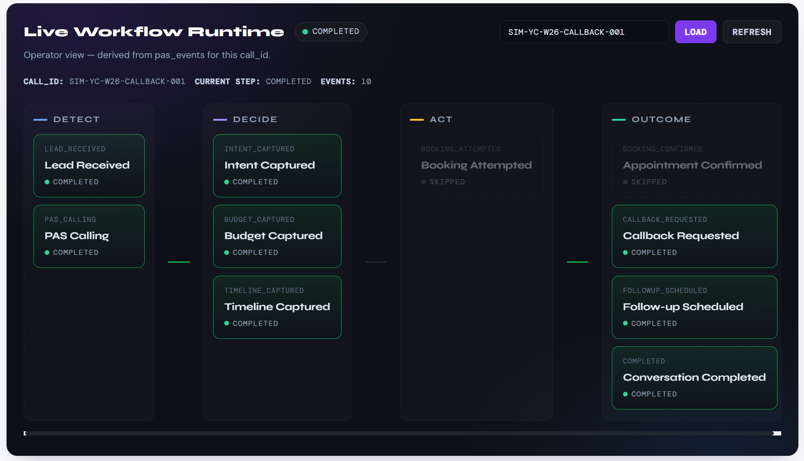
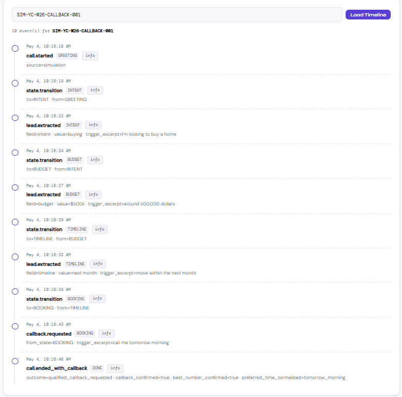

# PAS — Performative AI SuperStaff
*An ORVN Labs project*

When someone calls a real estate brokerage, PAS answers the phone. It talks to the lead like a person, asks what they want to do, what they can spend, and when they want to move. If the lead wants to book a viewing, PAS schedules it on the brokerage's calendar. If they want a callback instead, PAS confirms the time and the best number. Every call is saved as a clean, structured record. PAS works twenty-four hours a day. No call goes unanswered.

---

## What PAS does

- Answers inbound calls on the first ring.
- Asks the lead for intent (buy / sell / rent), budget, and timeline — and records their exact words.
- Handles pushback in real time ("I'm just looking", "just email me", price concerns) instead of dropping the call.
- Books a viewing on Cal.com when the lead says yes.
- Schedules a callback when they say not yet — confirming the time and the best number before hanging up.
- Logs every step of every call to a single append-only event stream (`pas_events`).
- Surfaces it in two dashboards built directly on that stream:
  - an **Admin Operations Console** — full payloads, operator vocabulary, for the ORVN team.
  - a **Brokerage Command Centre** — same data scoped to one brokerage, with sanitised payloads and plain-English step labels.

---

## Why this matters

The first brokerage to call back usually wins the lead. Most never get there. Calls drop to voicemail. Forms get ignored. The lead moves on. PAS answers every call the same way, every time, and hands the team a clean record by morning — so their time goes to the buyers who are ready, not to the ones who just wanted a phone number.

---

## Demo

One demo call is already seeded in the live system. Open it on either dashboard to see exactly what PAS produces — no phone call required.

- **call_id:** `SIM-YC-W26-CALLBACK-001`
- **brokerage:** `orvn-realty`
- **scenario:** a buyer with a $500k budget on a one-month timeline declines to book on the call and asks PAS to ring them back the next morning. PAS captures intent, budget, and timeline, registers the callback request, confirms the preferred time and best number, and ends the call cleanly.

The same `call_id` resolves on both surfaces:

- **Admin Operations Console:** `GET /admin/workflows/calls/SIM-YC-W26-CALLBACK-001` — returns the workflow envelope with operator-level step labels and the underlying event types. The full timeline is at `GET /admin/events/calls/SIM-YC-W26-CALLBACK-001`.
- **Brokerage Command Centre:** `GET /portal/workflows/calls/SIM-YC-W26-CALLBACK-001` (with the `orvn-realty` API key) — returns the same workflow translated into business-readable labels with sanitised payloads, scoped to the authenticated brokerage. The timeline is at `GET /portal/calls/SIM-YC-W26-CALLBACK-001/timeline`.

The expected workflow shape is `workflow_status=completed`, with `lead_received → pas_calling → intent_captured → budget_captured → timeline_captured` all completed, the booking branch correctly **skipped** (the lead pivoted to a callback before booking was offered), and `callback_requested → followup_scheduled → completed` all completed.

### Live Workflow Runtime

This is a real call processed end-to-end by PAS.
The system derives a structured workflow from raw events in real time.



### Event-Level Visibility

Every decision PAS makes is logged and reconstructable.



---

## Architecture

```
Twilio (inbound call)
  │
  ▼
POST /twilio/voice  ← FastAPI webhook
  │  returns TwiML with <Stream> WebSocket URL
  ▼
WebSocket /ws/media-stream/{call_sid}
  │
  ├─── mulaw audio → Deepgram (streaming STT)
  │                      │
  │               transcript events
  │                      │
  │                      ▼
  │              PAS State Machine
  │          (GREETING→INTENT→BUDGET→TIMELINE→BOOKING→CLOSING)
  │                      │
  │              objection? → Claude API (max 100 tokens)
  │                      │
  │              booking? → Cal.com API
  │                      │
  │              log → Supabase
  │                      │
  │               response text
  │                      │
  ├─── ElevenLabs TTS (mulaw output)
  │
  ▼
Twilio plays audio to caller
```

---

## Data Flow: Call Start → End

1. **Call arrives** → Twilio POSTs to `/twilio/voice`
2. **DB record created** → Supabase `calls` table, status=`active`
3. **TwiML returned** → instructs Twilio to open WebSocket media stream
4. **WebSocket opens** → `/ws/media-stream/{call_sid}`
5. **Greeting synthesized** → ElevenLabs → audio queued immediately
6. **Audio streams in** → Twilio sends base64 mulaw in media events
7. **Deepgram receives audio** → streams back transcripts
8. **PAS Engine processes transcript** → runs through state machine
9. **State: GREETING** → any response advances to INTENT
10. **State: INTENT** → extracts buy/sell/rent → advances to BUDGET
11. **State: BUDGET** → extracts dollar amount → advances to TIMELINE
12. **State: TIMELINE** → extracts timeframe → advances to BOOKING
13. **State: BOOKING** → asks for consent → calls Cal.com on yes
14. **State: CLOSING** → confirms booking → call ends
15. **Objection detected** (any state) → Claude generates rebuttal → resumes state
16. **WebSocket closes** → outcome + transcript written to Supabase
17. **Twilio status callback** → POST `/twilio/status` → duration finalized

---

## State Machine Reference

```
GREETING  → Did they pick up and respond? Yes → INTENT
INTENT    → buy/sell/rent extracted? Yes → BUDGET | retry (max 2) → BUDGET
BUDGET    → dollar amount detected? Yes → TIMELINE | retry (max 2) → TIMELINE
TIMELINE  → timeframe detected? Yes → BOOKING | forced → BOOKING
BOOKING   → lead says yes → Cal.com → CLOSING
            lead says no → CLOSING (not_booked)
CLOSING   → any response → DONE
OBJECTION → (any state) objection detected → Claude rebuttal → resume state
```

---

## Setup: Local Development

### Prerequisites
- Python 3.11+
- ffmpeg installed (`brew install ffmpeg` on Mac)
- ngrok for local tunneling

### Steps

```bash
# 1. Clone and enter the project
cd pas-engine

# 2. Create virtual environment
python -m venv venv
source venv/bin/activate  # Windows: venv\Scripts\activate

# 3. Install dependencies
pip install -r requirements.txt

# 4. Configure environment
cp .env.example .env
# Edit .env with your API keys

# 5. Set up Supabase schema
# Go to Supabase → SQL Editor → paste contents of scripts/schema.sql → Run

# 6. Start the server
uvicorn app.main:app --reload --port 8000

# 7. Expose locally with ngrok
ngrok http 8000
# Copy the https URL, e.g. https://abc123.ngrok.io
# Set BASE_URL=https://abc123.ngrok.io in your .env
# Restart uvicorn

# 8. Configure Twilio
# Go to: Twilio Console → Phone Numbers → your number → Voice
# Set Webhook URL: https://abc123.ngrok.io/twilio/voice  (POST)
# Set Status Callback: https://abc123.ngrok.io/twilio/status  (POST)

# 9. Call your Twilio number. PAS answers.
```

---

## Deployment: Railway

```bash
# 1. Install Railway CLI
npm install -g @railway/cli
railway login

# 2. Initialize project
railway init
# Select "Empty Project"

# 3. Add all environment variables
# Railway Dashboard → your project → Variables → paste all from .env

# 4. Deploy
railway up

# 5. Get your public URL
railway domain
# Copy URL → set as BASE_URL variable in Railway

# 6. Update Twilio webhook URLs to your Railway URL
# Twilio Console → Phone Numbers → Voice webhook → https://your-app.up.railway.app/twilio/voice
```

Railway automatically detects `nixpacks.toml` and installs ffmpeg.

---

## Required API Keys & Where to Get Them

| Service | Where | Notes |
|---|---|---|
| Twilio | console.twilio.com | Buy a phone number |
| Deepgram | console.deepgram.com | nova-2-phonecall model |
| ElevenLabs | elevenlabs.io | Get voice ID from Voice Library |
| Anthropic | console.anthropic.com | claude-sonnet-4 |
| Supabase | supabase.com | Create new project, use service key |
| Cal.com | cal.com/settings/developer | Create API key, get event type ID |

---

## Environment Variables

See `.env.example` for full list. All are required.

---

## Supabase Aggregation Queries

All queries are in `scripts/schema.sql` (commented out at bottom).

Quick reference:
```sql
-- Total bookings this month
SELECT COUNT(*) FROM calls
WHERE outcome = 'booked'
AND start_time >= DATE_TRUNC('month', NOW());

-- Conversion rate
SELECT
  ROUND(COUNT(*) FILTER (WHERE outcome = 'booked') * 100.0 /
  NULLIF(COUNT(*) FILTER (WHERE call_status = 'completed'), 0), 2) AS conversion_pct
FROM calls;
```

---

## Latency Budget

| Stage | Target | Implementation |
|---|---|---|
| STT (Deepgram) | 200–400ms | `nova-2-phonecall`, `endpointing=300` |
| Engine processing | <50ms | Pure Python, no I/O except on objection |
| TTS (ElevenLabs) | 200–400ms | `eleven_turbo_v2` model |
| **Total** | **<900ms** | |

Objection path (Claude) adds ~500ms — acceptable since it's non-linear.

---

## Definition of Done ✓

- [ ] Real call connects via Twilio
- [ ] PAS asks all 5 questions (intent, budget, timeline, booking consent, closing)
- [ ] Objection handled by Claude with rebuttal
- [ ] Cal.com appointment booked
- [ ] Call record in Supabase with outcome + transcript
